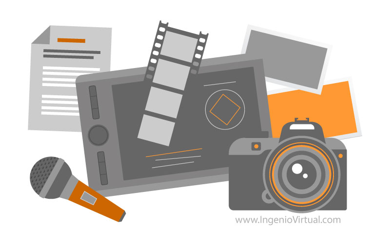

# Cómo usar OBS para transmitir en vivo
## Índice
1. [¿Qué es OBS y cómo usarlo?](#que-es-obs)
2. [Entorno](#entorno)
    - [Modo estudio](#modo-estudio)
    - [Escenas](#escenas)
        - [Manejo de escenas](#manejo-de-escenas)
    - [Fuentes](#fuentes)
        - [Manejo de fuentes](#manejo-de-fuentes)
        - [Grupos](#grupos)
        - [Ventanas y pantallas](#ventanas-y-pantallas)
        - [Audio](#audio)
    - [Transiciones](#transiciones)
        - [Manejo de transiciones](#manejo-de-transiciones)
3. [Transmitir](#transmitir)
    - [Transmisión en Youtube](#transmision-en-youtube)
    - [Transmisión en Zoom](#transmision-en-zoom)
4. [FabLAT FEST 2020](#fablat-fest-2020)
    - [Contexto](#contexto)
    - [Solución](#solucion)
        - [Diagrama de interacciones pre-incorporación de Instagram](#diagrama-pre-instagram)
        - [Diagrama de interacciones post-incorporación de Instagram](#diagrama-post-instagram)
        - [Limitaciones del modelo](#limitaciones-del-modelo)
        - [Material utilizado](#material-utilizado)
    - [Videos de la transmisión](#videos)
    - [Próximos desafíos](#proximos-desafios)

## ¿Qué es OBS y cómo usarlo? 
Open Broadcaster Software (OBS) es un programa gratuito y de código abierto para grabación de video y transmisión en vivo. Sirve para transmitir en diversas plataformas, entre ellas Twitch, YouTube, Facebook e Instagram.

Este instructivo documenta lo básico para comenzar a transmitir. Se empleará lenguaje simple y no hay nivel mínimo de conocimiento previo necesario. 

## Entorno 
La pantalla por defecto de OBS debería ser la siguiente:

Sin embargo se recomienda encarecidamente activar el Modo estudio, presionando el botón ubicado en el sector inferior derecho de la pantalla.

.png)

### Modo estudio 
.png)
A continuación explicaré cada sección y una breve descripción de ella:

1. **Menú**: Desde acá se puede acceder a opciones para la transmisión, importar y exportar escenas, entre otros.
2. **Pantalla de vista previa**: Como su nombre lo indica, es una previsualización de lo que aparecerá en la transmisión si decides mandarlo a la pantalla de programa.
3. **Transiciones añadidas para transmisión**: Para agregar o quitar transiciones configuradas (en el menú de configuración de transiciones) y para aplicarlas durante la transmisión. 
4. **Pantalla de programa**: Muestra lo que está transmitiéndose. Para actualizar lo que transmitimos deberemos hacer los cambios en la pantalla de vista previa y aplicar una transición.
5. **Menú de escenas**: Para agregar, quitar o modificar una escena.
6. **Menú de fuentes**: Para agregar, quitar o modificar una fuente
7. **Menú de reproducción de fuentes**: Si agregamos una fuente reproducible y la mandamos a la pantalla de programa se mostrarán controles para pausar, parar y reiniciar la reproducción, entre otros.
8. **Mezclador de audio**: Muestra las fuentes de audio disponibles de la escena. Si agregamos una fuente reproducible veremos su control de volumen en el mezclador.
9. **Menú de configuración de transiciones**: Para configurar una transición.
10. **Controles**: Botonera que contiene botones útiles. Sirve para grabar un respaldo de la transmisión, comenzar y detener la transmisión, configurar la transmisión como si fuera una cámara virtual, etc.

Para entender mejor cada tema, veremos los componentes en detalle.

### Escenas 
Una escena es una colección de fuentes. Al igual que en una obra de teatro una escena puede tener actores, fondos y música, una escena de OBS puede tener imágenes, videos y canciones.

>De la primera escena no mostrando nada (sin fuentes) podemos pasar a una escena en que los personajes (fuentes) aparecen, mediante la apertura del telón (transición).

#### Manejo de escenas 

- **(1) Agregar una escena**: Presionar el botón "+", luego escribir el nombre de la escena y presionar "Aceptar".
- **(2) Eliminar una escena**: Presionar la escena a eliminar, luego presionar el botón "-" y confirmar la eliminación. Las fuentes que aparecen en dicha escena también serán eliminados.
- **(3) Ordenar una escena**: Si tenemos muchas escenas y queremos que unas queden cerca de otras, seleccionamos la escena a mover y la movemos con cualquiera de los botones, según corresponda.
- **(4) Modificar una escena**: Seleccionamos la escena, damos click derecho y seleccionamos la opción que queramos.

### Fuentes 

Una fuente puede ser texto, una imagen, una galería de imágenes, un video, música, una lista de reproducción, un elemento obtenido desde el navegador o una ventana de otra aplicación.

#### Manejo de fuentes 

- **(1) Agregar una fuente**: Presionar el botón "+", luego seleccionar la fuente deseada, escribir el nombre de la fuente y presionar "Aceptar". A veces no aparece inmediatamente en la lista, pero puedes actualizar seleccionando otra escena y luego regresar a ella.
- **(2) Eliminar una fuente**: Presionar la fuente a eliminar, luego presionar el botón "-" y confirmar la eliminación.
- **(3) Modificar una fuente**: Seleccionamos la fuente, presionamos la tuerca para acceder a sus propiedades o damos click derecho y seleccionamos la opción que queramos.
- **(4) Ordenar una fuente**: Si queremos que una fuente quede más al frente en pantalla que otra, seleccionamos la escena a mover y la movemos con cualquiera de los botones, según corresponda.

#### Grupos 
Si deseas copiar y pegar varias fuentes en otras escenas, o mover varias fuentes a la vez, lo mejor es agruparlas. Para esto selecciona las fuentes manteniendo la tecla Shift presionada, luego presiona Click derecho y finalmente "Agrupar los elementos seleccionados".

Para desagruparlo lo seleccionas y presionas "Desagrupar".

#### Ventanas y pantallas 
##### Agregar ventana de Zoom
Dejo un apartado especial para Zoom, ya que existen casos cuando al agregar la fuente "Capturar Ventana" o "Captura de patalla" y seleccionamos Zoom, éste muestra una pantalla blanca en vez del contenido. Para solucionarlo, asegúrate de contar con la última versión de Zoom disponible y sigue estos pasos:

1. Damos click derecho en el ícono de Zoom en la barra de tareas de Windows y seleccionamos "Configuración".
.png)

2. Vamos a la pestaña "Video" y seleccionamos el botón "Avanzado".
.png)

3. En la lista "Método de representación de video" seleccionamos Direct3D 11 y cerramos la ventana.
.png)

##### Ajustar tamaño de una imagen, video, ventana o pantalla
En ocasiones vamos a querer que nuestras fuentes no ocupen el tamaño original. Para cambiar sus dimensiones, debemos:
1. Seleccionar la fuente en la pantalla de Vista Previa.
2. Presionar Ctrl+F para ajustarla en pantalla.
3. Mientras presionamos la tecla Shift, ir a un extremo de la fuente y arrastrando el mouse la ajustamos según nuestras necesidades.

##### Máscaras
A veces sólo necesitamos parte de la imagen, ya sea una foto, un video, una captura de ventana o pantalla. Para enmascarar una fuente y así sólo mostrar lo que queramos:
1. Seleccionar la fuente en la pantalla de Vista Previa.
2. Mientras presionamos la tecla Alt, ir a un extremo de la fuente y arrastrando el mouse definimos el área visible según nuestras necesidades.

#### Audio 
##### Escuchar lo que transmites
A veces debemos escuchar lo que OBS está reproduciendo (como cuando usamos la mezcla estéreo en vez del micrófono en una reunión Zoom). Para esto, en el Mezclador de audio damos click derecho y seleccionamos "Propiedades avanzadas de audio". 

.png)

Luego, en la pestaña "Monitorización de audio" seleccionamos "Monitorización activada y salida" en cada fuente que emita audio, para que tanto nosotros como el espectador en la transmisión podamos escucharlo.

.png)

### Transiciones 
Animaciones que sirven para cambiar de escena o actualizar alguna fuente en la transmisión de forma profesional.

#### Manejo de transiciones 
**(1) Para agregar una transición**, primero hay que configurarla:
1. En el menú de configuración de transiciones, presiona la lista de transiciones y selecciona la que quieras configurar.

.png)

2. Introduce un nombre y presiona "Aceptar".

.png)

3. Configura las propiedades que necesites. Si es un stinger localiza la transición presionando en "Examinar", ubicado en "Archivo de video" y establece los ms para el "Punto de transición" (generalmente es 500ms).

.png)

Finalmente lo agregas a la botonera y así tenerla disponible para la transmisión, presionando el '+' y seleccionando la transición recién configurada.

.png)

Para aplicar la transición durante la transmisión, sólo asegúrate de tener una Escena en la pantalla de Vista Previa diferente a la pantalla de Programa, y presiona el botón de la transición deseada.

.gif)

**(2) Para configurar una transición**, sólo selecciónala en el menú de configuración de transmisiones, presiona la tuerca y luego en "Propiedades".

**(3) Para eliminar una transición**, primero debes quitarla del menú de transiciones añadidas para transmisión, haciendo click en la pestaña de la misma y luego en "Eliminar".

.png)

Luego la seleccionas desde el menú de configuración de transiciones, presionas la tuerca y luego en "Eliminar".

.png)

## Transmitir 
### Transmisión en YouTube 
1. Ir a YouTube.
2. Presionar el botón de cámara y seleccionar "Transmitir en vivo".

.png)

3. Configurar título, descripción, y detalles de la transmisión.
4. Copiar la clave de transmisión.

.png)

5. En OBS, ir a Ajustes en el menú inferior derecho, luego en la pestaña Emisión, seleccionar "Youtube RTMP" y pegar la clave de transmisión copiada.

.png)
.png)

6. Guardamos los cambios y presionamos "Iniciar transmisión".

.png)

7. Para finalizar una transmisión, debemos terminar la transmisión desde YouTube presionando el botón "Finalizar transmisión" y luego desde el OBS presionando "Terminar transmisión" o viceversa.

### Transmisión en Zoom 
1. Activar la cámara virtual en OBS desde el menú inferior derecho.

.png)

2. Ir a Zoom y crear una reunión Premium, de esta forma tiene tiempo ilimitado.
3. Activar webcam como dispositivo OBS Virtual Camera.

.png)

4. Activar micrófono como dispositivo Mézcla estéreo. Si no aparece, debe activarlo desde el Panel de control de sonido, en la pestaña "Grabar".

.png)

Nota: Los participantes de la reunión escucharán todo lo que tu computador reciba, excepto tu micrófono. Se debe silenciar la reunión y toda aplicación que pueda emitir ruido, desde el mezclador de volumen de Windows.

Se recomienda deshabilitar los micrófonos de la reunión, de lo contrario los participantes hablarán sin obtener respuesta.

#### Activar micrófono
Si queremos que el director pueda hablar durante una transmisión en Zoom:
1. Damos click derecho en el ícono de audio en la barra de tareas de Windows y seleccionamos "Abrir Configuración de Sonido".
2. Presionamos "Panel de control de sonido".

.png)

3. Vamos a la pestaña "Grabar". Seleccionamos el micrófono, damos click derecho y presionamos "Propiedades".

.png)

4. Vamos a la pestaña "Escuchar", activamos la casilla "Escuchar este dispositivo" y aceptamos los cambios.

.png)

Nota: Se deben usar audífonos, ya que tu voz sonará en tu pantalla y volverá a escucharse por el micrófono, produciendo eco. Además, si tu micrófono no tiene botón de activación, este permanecerá encendido en todo momento. Para solucionar esto último, puedes ir a la pestaña "Niveles" y, cuando no quieras que escuchen tu micrófono, silenciarlo y aplicar los cambios.

.png)

## FabLAT FEST 2020 
### Contexto 
Fablab UTFSM, en celebración del FabLAT FEST 2020, realizará dos actividades para niños de básica y media. Sin embargo, debido a la crisis sanitaria del SARS-CoV-2 (también conocido como COVID-19) todo el evento debe transmitirse de manera online.

En esta ocasión, las plataformas elegidas fueron Zoom (aplicación para reuniones y videoconferencias) para el público objetivo y YouTube para público general, ambas transmitiendo de manera simultánea.

Posteriormente se incorporó la participación de sorteos en vivo vía Instagram.

### Solución 
#### Diagrama de interacciones pre-incorporación de Instagram 

##### Consideraciones
- Debido a que Zoom varía la presentación en función de las cámaras activadas, se decidió utilizar Google Meet para aislar a los presentadores.
- Para poder transmitir de Google Meet a Youtube, el video se transmite de forma automática mediante OBS, y el audio fue transmitido con la Mezcla estéreo activada con la opción Monitorización desactivada en el Mezclador de audio de OBS; mientras que para transmitir a Zoom, el Director activó la cámara configurada como una Cámara Virtual de OBS; y activó el micrófono configurado como la Mezcla estéreo (es decir, todo el sonido que el Director recibe es transmitido al Espectador). Para la música se activó la Monitorización y Salida en OBS, de esta forma tanto Zoom como Youtube recibían el audio.
- Por dicha razón, el Director silenció la reunión de Zoom mediante el mezclador de volumen de Windows y prohibió la activación de micrófonos a los participantes para evitar que hablen y no ser escuchados.
- Por el carácter del evento, se decidió prohibir la activación de cámaras y se ocultaron las imágenes de perfil de los participantes.

#### Diagrama de interacciones post-incorporación de Instagram 

##### Consideraciones
- El encargado de los sorteos debe comenzar a transmitir minutos antes de ser llamado en pantalla, para que el Director pueda ver la transmisión de Instagram desde el computador sin problemas.
- Para que pueda coordinarse bien con los presentadores, se elaboró un guión que tuviera marcas temporales para señalizar los momentos en los que los sorteos aparecerían en pantalla. Sin embargo, se recomienda que adicionalmente esté en la reunión de Google Meet como oyente. 

#### Limitaciones del modelo 
- El director sólo puede comunicarse mediante micrófono con los presentadores por Google Meet y a los espectadores de Youtube vía OBS, pero no a Zoom (debido a que tiene el micrófono configurado como Mezcla estéreo. La activación de la reproducción del micrófono via Panel de control de sonido en Windows, y el uso de unos audífonos, pueden solucionar este problema.
- Los presentadores no pueden ver la interacción por chat a menos que se conecten a la transmisión en Youtube y a Zoom, pero esto representa un riesgo al audio de la transmisión por el eco producido al tener el micrófono activado y escuchar la transmisión a la vez. Se puede evitar si los presentadores ven la transmisión con audífonos y silenciándola al momento de hablar. La incorporación de un Comentarista a la reunión de Google Meet que esté atento a ambas plataformas (Zoom y YouTube) también resuelve el problema.
- De forma similar, los presentadores no pueden ver lo que está sucediendo en la transmisión, pero la compartición de pantalla por Google Meet soluciona este problema parcialmente (no comparte el audio pero pueden apreciar la transmisión visualmente).

#### Material utilizado 
Si eres del equipo Multimedia del Fablab UTFSM y deseas usar la configuración de escenas, transiciones y fuentes utilizadas para la transmisión del FabLAT FEST 2020, puedes [descargarla aquí](https://drive.google.com/file/d/1llBtQA-_JPd4g3Y7jZGOMEyPOoH4blPW/view?usp=sharing). Una vez hecho esto:

1. Descomprime el material descargado en una carpeta de fácil acceso.

2. Instala la transición "Mover". Para esto extrae las carpetas "data" y "obs-plugins" del archivo "move-transition-2.0.2-windows.zip", luego córtalas y pégalas en el directorio del OBS (Generalmente C:\Program Files\obs-studio).

3. En OBS, ve al menú superior y en la pestaña "Colección de Escenas" presiona "Importar".

.png)

4. En "Ruta de la colección" presiona los tres puntos suspensivos y selecciona el archivo JSON que acabas de descomprimir. Luego oprime "Importar".

.png)

5. Ve nuevamente a "Colección de Escenas" y selecciona "Fablat 2020".

.png)

6. Corregir ubicaciones de las fuentes. Para esto presiona una fuente, luego click derecho y "Propiedades" y actualiza la ubicación según corresponda. Este proceso debe repetirse con todas las fuentes.

Si no perteneces al equipo y deseas acceso temporal, puedes mandar un correo a multimedia@fablab.usm.cl con el asunto "Obtener acceso al material de OBS - FabLAT FEST 2020".

### Videos de la transmisión 

### Próximos desafíos 
- Usar otras entradas de audio en vez de la mezcla estéreo. De esta forma se podrá permitir que los participantes de Zoom activen su micrófono.
